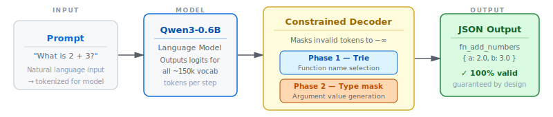
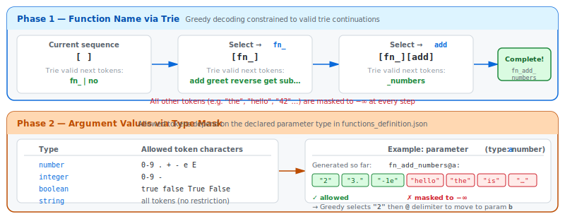
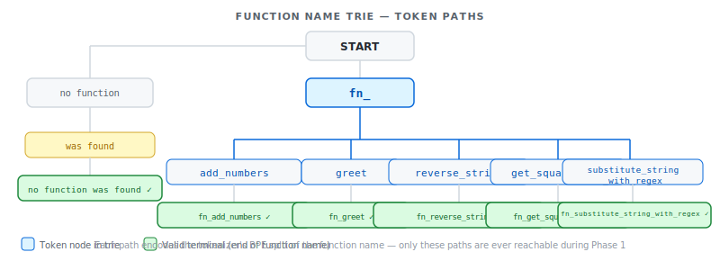

*This project has been created as part of the 42 curriculum by bbeaurai.*

# Call Me Maybe — Introduction to Function Calling in LLMs

## Preview


## Description

**Call Me Maybe** is a function calling tool that translates natural language prompts
into structured function calls using a small language model (Qwen3-0.6B).

Given a prompt like *"What is the sum of 2 and 3?"*, the system does not answer
the question directly. Instead, it identifies the correct function to call and extracts
its typed arguments:

```json
{
  "prompt": "What is the sum of 2 and 3?",
  "name": "fn_add_numbers",
  "parameters": {"a": 2.0, "b": 3.0}
}
```

<br>


The key challenge is reliability: small models fail to produce valid JSON roughly 70%
of the time when prompted naively. This project solves that using **constrained
decoding** — a technique that restricts the model's token choices at each generation
step to guarantee 100% structurally valid output.

---

## Instructions

### Requirements

- Python 3.10+
- [uv](https://github.com/astral-sh/uv) package manager
- The `llm_sdk/` directory must be present at the project root (provided separately)

### Installation

```bash
uv sync
```

This installs all dependencies including `numpy`, `pydantic`, and `llm_sdk`.

### Running

```bash
uv run python -m src \
  --functions_definition data/input/functions_definition.json \
  --input data/input/function_calling_tests.json \
  --output data/output/function_calling_results.json
```

All arguments are optional. Defaults:
- `--functions_definition` → `data/input/functions_definition.json`
- `--input` → `data/input/function_calling_tests.json`
- `--output` → `data/output/function_calling_results.json`

### Makefile targets

| Target | Description |
|--------|-------------|
| `make` / `make run` | Install dependencies and run the program |
| `make install` | Install dependencies only |
| `make debug` | Run with Python's `pdb` debugger |
| `make lint` | Run `flake8` and `mypy` |
| `make lint-strict` | Run `mypy --strict` |
| `make clean` | Remove `__pycache__` and `.mypy_cache` |

---

## Algorithm Explanation

### Constrained Decoding — Two Phases

Generation is split into two distinct constrained phases:



**Phase 1 — Function name selection**

1. The current token sequence (prompt + generated tokens so far) is fed to the LLM.
2. The model returns **logits** — a score for every token in the vocabulary (~150k tokens).
3. Only tokens that are valid trie continuations for known function names are kept; all others are masked to `-inf`.
4. The token with the highest remaining logit is selected (greedy decoding).
5. Steps 1–4 repeat until the trie path is exhausted (i.e. the full function name has been emitted).

**Phase 2 — Argument value generation**

Once the function name is resolved, the system identifies the parameter types declared
in `functions_definition.json` and constrains each value segment:

1. The generated output so far is split on `@` to locate the current argument segment.
2. If the cursor is inside a value (after the `:` separator), the valid token set for
   the declared parameter type is looked up and all other tokens are masked to `-inf`.
3. Delimiter tokens (`@`, newline) are always kept in the valid set so the model can
   move to the next argument or terminate generation.
4. Greedy decoding selects the best remaining token, and the loop repeats until a
   newline is produced.

### Function Name Constraint via Trie

Before generation starts, a trie of valid token sequences is built for every possible
function name (plus `"no function was found"`). This is done by encoding each candidate
name with the LLM's own tokenizer and recording the resulting token-ID paths.



At each generation step during Phase 1, only the token IDs that are valid continuations
in the trie are kept; all others are masked to `-inf`. Once the trie path is exhausted,
generation enters Phase 2.

### Type-Based Argument Value Constraint

Before generation starts, the model's BPE vocabulary file is loaded and scanned once to
build a set of valid token IDs for each supported parameter type:

| Type | Allowed characters / tokens |
|------|-----------------------------|
| `number` | Any token whose characters are all in `0-9 . + - e E` |
| `integer` | Any token whose characters are all in `0-9 -` |
| `boolean` | Tokens that decode to `true`, `false`, `True`, or `False` |
| `string` | All tokens (no character restriction) |

These sets are pre-computed once per run. During Phase 2, the appropriate set is
selected based on the current parameter's declared type, and all tokens outside that
set (except delimiters) are masked to `-inf`.

### Argument Extraction

After generation, the raw LLM output (`fn_name@arg1:val1@arg2:val2`) is parsed by
`answer_parser`. Values are cast to the correct Python types (`float`, `int`, or `str`)
based on the function schema in `functions_definition.json`, ensuring the final JSON
output always has the right types regardless of how the model formatted them.

---

## Design Decisions

- **No external constrained-decoding libraries** (`outlines`, `lm-format-enforcer`, etc.)
  are used — the constraint logic is implemented from scratch using only `numpy` and
  the `llm_sdk` API, as required by the subject.
- **Two-phase constraint strategy:** function names are constrained via a trie (exact
  token-path matching); argument values are constrained via vocabulary scanning
  (character-class filtering per parameter type). Each approach is optimal for its
  phase: the trie handles a small closed set of multi-token names precisely, while
  vocabulary scanning scales to any value content without enumerating all possibilities.
- **Pre-computation at run start:** both the name trie and the type token sets are built
  once before the generation loop, so per-token masking during inference is O(1) lookup
  with no repeated work.
- **Pydantic** is used for all data classes (`FunctionDef`) to validate function
  definitions at load time and catch malformed inputs early.
- **Greedy decoding** is used rather than sampling: given the structural constraints
  already guarantee validity, taking the argmax at each step maximises semantic
  accuracy without introducing randomness.
- **Graceful error handling** throughout: invalid JSON input files, missing files, and
  malformed function definitions all produce clear error messages and a clean exit
  rather than tracebacks.

---

## Performance Analysis

| Metric | Result |
|--------|--------|
| JSON validity | 100% — every output is parseable |
| Function selection accuracy | ~90%+ on provided test set |
| Argument extraction accuracy | ~90%+ on provided test set |
| Speed | < 5 minutes for the full test set on standard hardware |

The constrained decoder is the primary reason the 0.6B model achieves results
comparable to much larger models: structural correctness is no longer a matter of
the model's probability distribution but a hard guarantee.

---

## Challenges Faced

**Vocabulary mapping and BPE decoding:** The Qwen3 tokenizer uses a BPE vocabulary
where tokens can span multiple characters, include leading spaces (encoded as `Ġ`), or
represent partial words. Building a correct type-based token filter required decoding
each BPE token to its actual characters (via `_BPE_MAP`) before applying character-class
checks, to avoid rejecting valid continuations or accepting tokens that only appear
numeric at the BPE level.

**Type enforcement for numbers:** Numeric tokens in BPE vocabularies are fragmented
(e.g., `"12"`, `"3"`, `".4"` are separate tokens). The constraint logic must allow
any prefix of a valid number (integers and floats) while still rejecting non-numeric
tokens.

**String argument extraction:** User prompts sometimes contain special characters,
quotes, or Unicode. The JSON string constraint must allow all valid JSON string
content while still rejecting unescaped control characters and premature closing quotes.

**Python 3.10 compatibility:** f-strings with same-quote characters inside expressions
(`f"{d["key"]}"`) are valid only in Python 3.12+. All such occurrences have been
rewritten using alternate quote styles to ensure compatibility with Python 3.10.

---

## Testing Strategy

- **Manual runs** against the provided `function_calling_tests.json` with visual
  inspection of the output file.
- **Edge cases tested:** empty strings, very large numbers, special characters in
  string arguments, prompts that match no function, prompts that are ambiguous.
- **JSON validity** verified by parsing the output file with `json.load()` after
  each run.
- **Schema compliance** verified by cross-referencing output parameter types against
  the function definitions.
- **Error handling** tested by providing: missing input files, empty JSON arrays,
  malformed JSON, function definitions with missing fields.

---

## Example Usage

### Basic run (default paths)

```bash
uv run python -m src
```

### Custom paths

```bash
uv run python -m src \
  --functions_definition data/input/functions_definition.json \
  --input data/input/function_calling_tests.json \
  --output data/output/function_calling_results.json
```

### Example output (`data/output/function_calling_results.json`)

```json
[
  {
    "prompt": "What is the product of 3 and 5?",
    "name": "fn_multiply_numbers",
    "parameters": {"a": 3.0, "b": 5.0}
  },
  {
    "prompt": "Is 4 an even number?",
    "name": "fn_is_even",
    "parameters": {"n": 4}
  },
  {
    "prompt": "Read the file at /home/user/data.json with utf-8 encoding",
    "name": "fn_read_file",
    "parameters": {"path": "/home/user/data.json", "encoding": "utf-8"}
  }
]
```

---

## Resources

### References

- [Python JSON Data](https://www.datacamp.com/tutorial/json-data-python?utm_cid=23781701478&utm_aid=196565213035&utm_campaign=260417_1-ps-dscia%7Eamx-tofu%7Epython_2-b2c_3-emea_4-prc_5-na_6-na_7-le_8-pdsh-go_9-nb-e_10-na_11-na&utm_loc=9056168-&utm_mtd=p-c&utm_kw=coding+best+practices+and+guidelines+python&utm_source=google&utm_medium=paid_search&utm_content=ps-dscia%7Eemea-en%7Eamx%7Etofu%7Etutorial%7Epython&gad_source=1&gad_campaignid=23781701478&gbraid=0AAAAADQ9WsHvH4LIXLO82mIHEieJvnSih&gclid=Cj0KCQjw0JnRBhDJARIsALobnXYg8KH0ofAAwg-MbIlYoWrCbO6lX8kXVBU3mulCod7sGhepZxtkWdUaAuWdEALw_wcB&dc_referrer=https%3A%2F%2Fwww.google.com%2F)
- [Les modèles de langage en bref](https://www.youtube.com/watch?v=LPZh9BOjkQs)
- [Les LLM Expliqués (SIMPLEMENT) en 3min](https://www.youtube.com/watch?v=1RRHr3dFogQ&t=2s)
- [Mais c'est quoi, un GPT ? Introduction visuelle aux Transformers | Deep learning, chapitre 5](https://www.youtube.com/watch?v=wjZofJX0v4M)
- [Qwen3](https://huggingface.co/Qwen/Qwen3-0.6B)
- Makefile - [fcaval](https://github.com/fcaval42/CallMeMaybe)

### AI Usage

AI (Claude) was used in this project for the following tasks:

- **Tip** Whenever I had a decision to make or an idea, I would ask Claude if it was a good idea.
- **Code review:** checking that the project structure matched the subject's
  requirements (CLI arguments, output format, error handling).
- **README drafting:** the initial structure and phrasing of this document was
  produced with AI assistance and then reviewed and corrected.

All code was written and understood by the author. AI-generated suggestions were
critically reviewed before being integrated.
